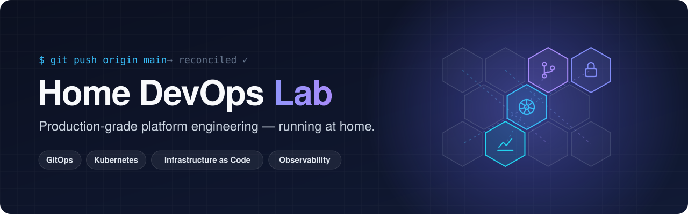

GitOps-driven Kubernetes, Infrastructure as Code and observability, 
built and operated like a real product, on hardware you can own.

---

## 🚀 What we do

Home DevOps Lab is an engineering playground with production habits. Every service is declared in Git, every change goes through a pipeline, and every component is monitored. The result is a set of reusable building blocks you can lift into your own lab — or your day job.

| | |
|---|---|
| ⚙️ **GitOps first** | The cluster state lives in Git. Flux CD reconciles it, Renovate keeps it fresh, SOPS keeps secrets safe. |
| 🏗️ **Infrastructure as Code** | Proxmox VMs, cloud resources on AWS and Azure — all provisioned with Terraform, Terragrunt and Ansible. |
| 📈 **Observability built in** | Prometheus, Grafana, Alertmanager and log aggregation from day one, not as an afterthought. |
| 🔐 **Security by default** | Secrets in Vault and SOPS, TLS everywhere via cert-manager and Let's Encrypt, tested backups. |
| 🏠 **Self-hosted & independent** | Own your data and your platform — no vendor lock-in, no surprise changes to terms of service. |

## 📦 Open-source building blocks

| Project | What it is | Stack |
|---|---|---|
| [**appchart**](https://github.com/HomeDevopsLab/appchart) | One reusable Helm chart for every app — services, ingress with TLS, volumes, probes and Flux image automation. | `Helm` `Flux CD` `Traefik` |
| [**iac-tools**](https://github.com/HomeDevopsLab/iac-tools) | Batteries-included CI image with Terraform, Terragrunt, Ansible, Vault, `gh` and `glab`. | `Docker` `Terraform` `Ansible` |
| [**tfmodule-ses**](https://github.com/HomeDevopsLab/tfmodule-ses) | Terraform module for AWS SES — sending and receiving mail on your own domain. | `Terraform` `AWS` |
| [**docs**](https://github.com/HomeDevopsLab/homedevopslab.github.io) | Source of the lab knowledge base, published at [docs-lab.angrybits.pl](https://docs-lab.angrybits.pl) (PL / EN). | `VuePress` `Docker` |

## 🧭 Under the hood

## 🛠️ Tech stack

## 💡 Why a homelab?

> The fastest way to learn the cloud is to run one yourself.

A homelab lets you experiment with the latest technologies without public-cloud bills, safely test solutions before they reach production, and keep full control over your own data.

---

**[📖 Read the docs](https://docs-lab.angrybits.pl)** · **[⭐ Star a project](https://github.com/orgs/HomeDevopsLab/repositories)** · **[💬 Open an issue](https://github.com/HomeDevopsLab/appchart/issues)**

